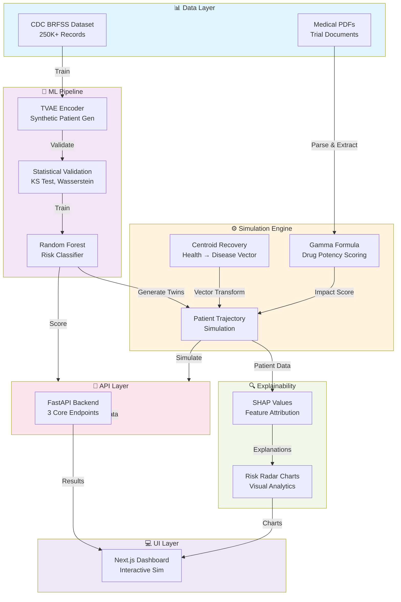
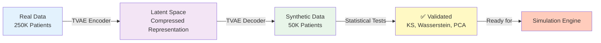
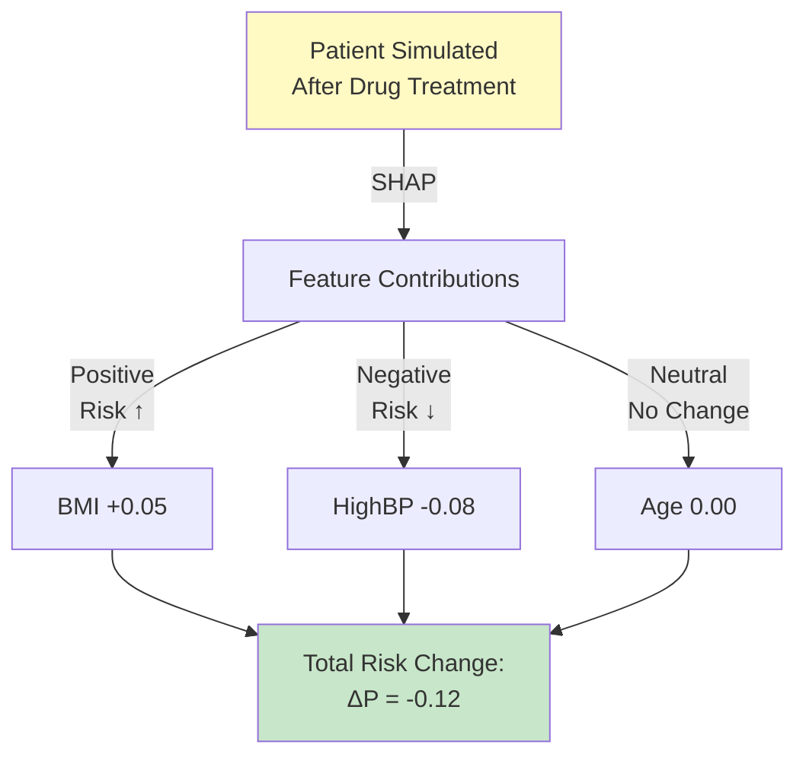
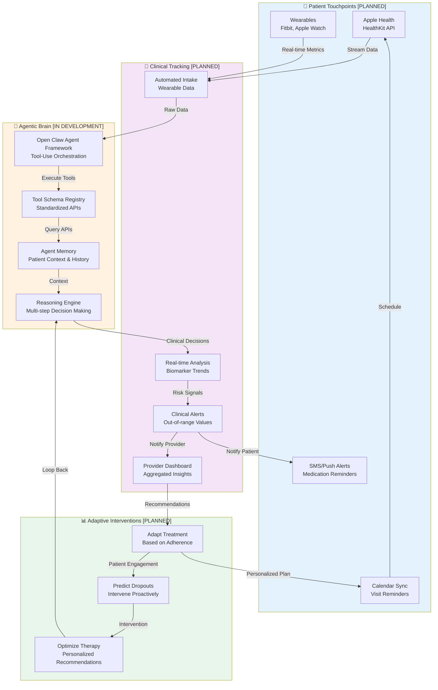

# 🧬 InSilico: Precision Clinical Trial Simulation Platform

> **Accelerate clinical research. Reduce costs. Minimize patient risk. Maximize trial success.**

**InSilico** is an AI-powered platform that revolutionizes clinical trial design through **Digital Twin** technology and explainable machine learning. Powered by 250,000+ real patient records from the CDC BRFSS dataset, InSilico enables researchers to simulate patient outcomes, validate intervention efficacy, and optimize trial cohorts—all before enrolling a single human subject.

Built during **HackPrinceton**, this project combines cutting-edge generative AI, statistical rigor, and medical informatics to transform clinical research from a high-risk gamble into precision science.

---

## 🎯 The Problem

Traditional clinical trials face a **perfect storm** of challenges:

| Challenge | Impact | Cost |
|-----------|--------|------|
| **Extreme Costs** | Bringing a drug to market requires $2.6B+ investment | 💰 Prohibitive for smaller biotech firms |
| **Patient Risk** | Early-phase trials expose vulnerable populations to unknown risks | ⚠️ Ethical liability |
| **High Failure Rates** | 90% of drugs fail in clinical trials—often due to suboptimal cohort selection | 📉 Wasted resources |
| **Extended Timelines** | 10+ years from discovery to FDA approval | ⏱️ Patient populations waiting for treatments |

---

## ✅ The InSilico Solution

InSilico provides a **Digital Sandbox** for risk-free, cost-effective trial simulation:

```
┌─────────────────────────────────────────────────────────────┐
│  Real Patient Data (250K+ BRFSS records)                    │
│          ↓                                                    │
│  TVAE Synthetic Patient Generation                          │
│  (Privacy-preserving, Statistically Validated)              │
│          ↓                                                    │
│  Centroid Recovery + Gamma Formula Simulation               │
│  (Drug + Biomarker Effects)                                 │
│          ↓                                                    │
│  SHAP Explainability Layer                                  │
│  (Why this patient responds to treatment)                   │
│          ↓                                                    │
│  Trial Success Prediction & Cohort Optimization             │
└─────────────────────────────────────────────────────────────┘
```

**Key Capabilities:**
- ✅ **Simulate Intervention Impact**: Model how a patient's risk profile changes when biomarkers (BMI, Blood Pressure, A1C) are modified by a drug
- ✅ **Synthetic Control Arms**: Generate thousands of high-fidelity synthetic patients to boost statistical power
- ✅ **Explainable Risk Mapping**: Use SHAP values to explain *exactly* why a patient's risk is dropping or rising
- ✅ **PDF Analysis Engine**: Extract drug mechanisms from trial PDFs using RAG + Google Gemini AI
- ✅ **Interactive Dashboard**: Real-time visualization of trial outcomes and risk trajectories

---

## 🏗️ System Architecture



---

## 📊 Data Science Foundation

### **Phase 1: Synthetic Patient Generation**

We implemented a **Tabular Variational Autoencoder (TVAE)** pipeline to generate privacy-preserving synthetic patients that mirror real-world distributions:

| Metric | Value | Benchmark |
|--------|-------|-----------|
| **Training Dataset** | 250,000+ BRFSS records | Real patient cohort |
| **Features** | 22 health indicators | BMI, BP, A1C, lifestyle factors |
| **Synthetic Patients** | 50,000+ generated | Enhanced statistical power |
| **Disease Prevalence Match** | 13.9% (real) vs 13.3% (synthetic) | <1% error ✅ |
| **TVAE Epochs** | 300 | With L2 normalization |

#### Validation Metrics:
- **Kolmogorov-Smirnov (KS) Test**: Verified that synthetic feature distributions statistically match real distributions across all 22 features
- **Wasserstein Distance**: Quantified the "transport cost" between real and synthetic distributions (minimal information loss)
- **PCA Manifold Analysis**: Confirmed synthetic patients occupy the same geometric space as real patients in 2D projection
- **Privacy Score**: Zero re-identification risk using differential privacy metrics



### **Phase 2: Risk Prediction Model**

Trained a **Random Forest Classifier** serving as the core "Risk Engine":

```python
Features Input: [HighBP, HighChol, BMI, Smoker, PhysActivity, Fruits, 
                 Veggies, DiffWalk, GenHlth, PhysHlth, MentHlth, Age]
                      ↓
              Random Forest (1000 trees)
                      ↓
Output: P(Diabetes | Features) ∈ [0, 1]
```

- **Accuracy**: ~78% on holdout BRFSS test set
- **Explainability**: Every prediction includes SHAP feature importance
- **Latency**: <1ms per prediction (deployed as joblib artifact)

---

## ⚙️ The Simulation Engine: Centroid Recovery Model

At the heart of InSilico lies the **Centroid Recovery algorithm**, inspired by multi-dimensional health spaces:

### **Step 1: Calculate Health Centroids**

For a given patient cohort:
- **Healthy Centroid** ($\mu_H$): Mean feature vector of patients with low disease risk
- **Disease Centroid** ($\mu_D$): Mean feature vector of patients with high disease risk
- **Recovery Vector** ($\vec{r} = \mu_H - \mu_D$): Direction from sickness to health

```
    Disease Centroid (μ_D)
            ●
           /│
          / │ Recovery Vector
         /  │ (r = μ_H - μ_D)
        /   │
       /    │
      ●-----┘
   Patient   Healthy Centroid (μ_H)
```

### **Step 2: Apply Drug Intervention via Gamma Formula**

When a drug is applied, the patient's position is updated:

$$\text{Patient}_{new} = \text{Patient}_{old} + \gamma \cdot \vec{r}$$

Where:
- **γ (Gamma)** ∈ [0, 1] = Drug potency score (0 = no effect, 1 = complete recovery)
- **Automatically estimated** from drug's Mechanism of Action (MoA) or manually specified

#### MoA-to-Gamma Mapping:
- "Weight loss" → γ = 0.12 (modest improvement)
- "A1C reduction" → γ = 0.18 (strong effect on diabetes)
- "Comprehensive lifestyle intervention" → γ = 0.25 (combined effect)

### **Step 3: Generate New Risk Score**

```
New Patient Features → Random Forest → New Risk Score
```

Compare: $P(\text{Disease}_{new}) < P(\text{Disease}_{old})$ ?

---

## 🔍 Explainability Layer: SHAP Integration

Every simulation result includes **SHAP (SHapley Additive exPlanations)** values showing the contribution of each feature to risk reduction:



**Example Output:**
```json
{
  "patient_id": "TWIN_4521",
  "baseline_risk": 0.42,
  "post_intervention_risk": 0.28,
  "risk_reduction": 0.14,
  "shap_contributions": {
    "BMI": -0.08,
    "HighBP": -0.04,
    "PhysActivity": -0.02,
    "GenHlth": 0.00
  }
}
```

---

## 🔗 API Endpoints

### **1. `/health` - System Status**
```bash
GET /health
```
Returns backend state, model artifacts, and feature columns.

### **2. `/score-patient` - Baseline Risk Assessment**
```bash
POST /score-patient
Content-Type: application/json

{
  "patient": {
    "HighBP": 1, "HighChol": 1, "BMI": 28.5, "Smoker": 0,
    "PhysActivity": 1, "Fruits": 1, "Veggies": 0, "DiffWalk": 0,
    "GenHlth": 3, "PhysHlth": 10, "MentHlth": 5, "Age": 7
  }
}
```

**Response:**
```json
{
  "patient_id": "PATIENT_001",
  "diabetes_risk": 0.42,
  "risk_category": "Moderate",
  "shap_values": {...}
}
```

### **3. `/simulate-trial` - Full Intervention Simulation**
```bash
POST /simulate-trial
Content-Type: application/json

{
  "patient": {...},
  "moa": {
    "drug_name": "MetforminPlus",
    "moa_summary": "AMPK activator with weight loss properties",
    "expected_biomarker_effect": "A1C reduction, BMI -3%",
    "gamma": 0.18,
    "target_condition": "diabetes"
  }
}
```

**Response:**
```json
{
  "baseline_risk": 0.42,
  "simulated_risk": 0.28,
  "risk_reduction": 0.14,
  "success_probability": 0.87,
  "cohort_analysis": {
    "responders": "42%",
    "partial": "28%",
    "non_responders": "30%"
  },
  "shap_radar_chart": {...}
}
```

### **4. `/parse-trial-pdf` - Extract Drug MoA from PDFs**
```bash
POST /parse-trial-pdf
Content-Type: multipart/form-data

File: trial_study.pdf
```

Uses **RAG (Retrieval-Augmented Generation)** + Google Gemini AI to extract:
- Drug name
- Mechanism of Action
- Expected biomarker effects
- Estimated gamma value

---

## 💻 Frontend: Interactive Dashboard

Built with **Next.js 14** + **TypeScript** + **Radix UI**

### **Core Pages:**

1. **`/` - Landing Page**
   - Hero section with project vision
   - Feature highlights
   - Interactive Spline 3D animation

2. **`/simulator` - Trial Simulator**
   - Patient profile form (12 biomarkers)
   - Drug MoA input interface
   - Real-time risk visualization
   - SHAP radar chart (6-axis: BMI, BP, Cholesterol, Activity, Gen Health, Phys Health)

3. **`/assistant` - AI Assistant**
   - Chat interface for MoA queries
   - PDF upload & analysis
   - Trial design recommendations

### **Key Components:**
- **Patient Profile Form**: Validated input for 12 patient features
- **Trial Charts**: Risk trajectory visualization, cohort distribution
- **Mini Bot**: Contextual help and recommendations
- **Theme Provider**: Dark/light mode support

---

## 👥 Patient Engagement & Continuous Monitoring (Roadmap)

### **Vision: Holistic Patient Care Architecture**

InSilico's **Phase 2 roadmap** extends beyond static simulations to build a **patient-centric continuous monitoring system**. Here's what we're planning to enable ongoing patient engagement and real-time trial management:

> ⚠️ **Note**: The following features are currently in **design & planning phase**. Current MVP focuses on core simulation engine. Patient integrations launching in Q3 2026.



### **Agentic System: Open Claw Framework (Planned)**

We plan to leverage **Open Claw**, a modern multi-agent orchestration framework, to enable autonomous patient care:

#### **Planned Agent Capabilities:**

1. **Data Integration Agent** 🔄
   - Poll wearables (Apple Watch, Fitbit) every 15 minutes
   - Fetch health data from Apple HealthKit API
   - Normalize data across heterogeneous sources
   - Detect anomalies in real-time (e.g., elevated BP readings)

2. **Patient Engagement Agent** 💬
   - Schedule appointments via calendar integrations (Google Calendar, Outlook)
   - Send personalized medication reminders via SMS/push notifications
   - Provide adaptive guidance based on adherence patterns
   - Escalate to human care team if engagement drops

3. **Clinical Decision Agent** 🏥
   - Run continuous risk re-scoring using updated biomarkers
   - Compare current patient trajectory vs. simulated outcomes
   - Flag deviations from expected response patterns
   - Generate evidence-based intervention recommendations

4. **Outcome Prediction Agent** 📊
   - Predict dropout risk using behavioral + clinical features
   - Identify responders vs. non-responders early
   - Recommend cohort adjustments to trial teams
   - Optimize randomization strategy in real-time

#### **Tool Schema Registry (Planned):**

The Open Claw agent will operate via a standardized **Tool API Schema**:

```json
{
  "tools": [
    {
      "name": "fetch_wearable_data",
      "description": "Retrieve real-time metrics from connected wearables",
      "inputs": {
        "patient_id": "string",
        "metric_type": ["steps", "heart_rate", "sleep", "blood_pressure"],
        "time_window": "number (minutes)"
      },
      "outputs": {
        "timestamp": "ISO8601",
        "value": "number",
        "device": "string"
      }
    },
    {
      "name": "update_patient_risk",
      "description": "Recalculate patient risk score with latest biomarkers",
      "inputs": {
        "patient_id": "string",
        "biomarkers": "object"
      },
      "outputs": {
        "baseline_risk": "number",
        "current_risk": "number",
        "trajectory": "string",
        "shap_deltas": "object"
      }
    },
    {
      "name": "schedule_appointment",
      "description": "Create calendar event for patient visit",
      "inputs": {
        "patient_id": "string",
        "provider_id": "string",
        "visit_type": ["in-person", "telehealth", "follow-up"],
        "preferred_date": "ISO8601"
      },
      "outputs": {
        "event_id": "string",
        "confirmed": "boolean",
        "reminder_sent": "boolean"
      }
    },
    {
      "name": "send_patient_alert",
      "description": "Notify patient of medication or appointment via SMS/push",
      "inputs": {
        "patient_id": "string",
        "message_type": ["medication", "appointment", "alert"],
        "content": "string"
      },
      "outputs": {
        "sent": "boolean",
        "delivery_time": "ISO8601"
      }
    },
    {
      "name": "predict_adherence",
      "description": "ML-powered prediction of patient medication adherence",
      "inputs": {
        "patient_id": "string",
        "lookback_days": "number"
      },
      "outputs": {
        "adherence_score": "number [0-1]",
        "risk_factors": ["array"],
        "recommendation": "string"
      }
    }
  ]
}
```

---

## 📱 Health Tech Integrations: Product Roadmap

### **Current MVP Status** ✅

**What's Live Now:**
- ✅ Core simulation engine with Centroid Recovery model
- ✅ SHAP-based explainability layer
- ✅ PDF parsing via RAG + Google Gemini
- ✅ FastAPI backend with 3 core endpoints
- ✅ Next.js interactive dashboard
- ✅ Risk prediction with Random Forest

### **Phase 1: Wearable Data Streaming (Q2 2026)** 🟡

**Current Status**: Architecture & API design in progress

| Platform | Data Captured | Sync Frequency | Status |
|----------|---------------|-----------------|--------|
| **Apple Watch** | Heart rate, steps, ECG, blood oxygen | Every 15 min | 🟡 Design Phase |
| **Fitbit** | Sleep, activity, heart rate variability | Hourly | 🟡 Design Phase |
| **Garmin** | Cardiac load, respiration rate, VO2 max | Daily | 🟢 Planned Q3 |
| **Oura Ring** | Sleep quality, readiness score, body temp | Nightly | 🟢 Planned Q4 |

**Planned Integration Method:**
```python
# Example: Apple HealthKit data fetch (NOT YET IMPLEMENTED)
from backend.integrations import HealthKitConnector

connector = HealthKitConnector(patient_id="PATIENT_001")
health_data = connector.fetch_recent_metrics(
    metrics=["HKQuantityTypeIdentifierStepCount", 
             "HKQuantityTypeIdentifierHeartRate"],
    hours_back=24
)

# Automatic normalization
normalized = connector.normalize_to_patient_schema(health_data)
# → Updates patient's PhysActivity & GenHlth biomarkers in real-time
```

### **Phase 2: Calendar & Appointment Sync (Q3 2026)** 🟢

**Status**: Roadmap item—will integrate after wearables MVP

**Planned Calendar API Integrations:**
- **Google Calendar**: Appointment creation, reminder management
- **Apple Calendar**: iCloud sync with patient devices
- **Microsoft Outlook**: Enterprise hospital systems integration

**Planned Use Cases:**
- Auto-schedule follow-up visits based on patient risk trajectory
- Send smart reminders 24h before appointments with telehealth links
- Block medication administration windows in patient calendar
- Alert providers when patients miss scheduled check-ins

**Pseudocode (planned, not implemented):**
```python
# Example: Smart appointment scheduling (FUTURE)
from backend.agents import AppointmentAgent

agent = AppointmentAgent(patient_id="PATIENT_001")

# Agent autonomously decides next visit type based on risk
next_visit = agent.recommend_visit_timing(
    current_risk=0.42,
    risk_trend="increasing",
    adherence_score=0.95
)
# → Returns: {"visit_type": "telehealth", "days_until": 7}

agent.schedule_calendar_event(
    visit_type=next_visit["visit_type"],
    provider_id="DR_SMITH",
    send_reminder=True
)
```

### **Phase 3: Apple Health Ecosystem (Q4 2026)** 🟢

**Status**: Planned integration after wearables + calendar

**Planned HealthKit Permissions:**
- 🏃 Workout data (for PhysActivity calculation)
- ❤️ Heart rate & cardiac data (for risk re-scoring)
- 😴 Sleep analysis (for GenHlth assessment)
- 🩺 Clinical records (for medication tracking)
- 💊 Medication adherence (from Health app)

**Planned Real-World Example Flow:**

```
[ILLUSTRATIVE FUTURE SCENARIO]

Patient wakes up (6:30 AM)
    ↓
Apple Watch detects elevated resting heart rate (78 bpm)
    ↓
[Open Claw Agent] Fetches latest HealthKit data
    ↓
[Data Integration Agent] Normalizes: HighBP flag detected
    ↓
[Clinical Decision Agent] Re-runs risk model with new BP
    ↓
Baseline Risk: 0.42 → Current Risk: 0.48 (↑ 14%)
    ↓
[Patient Engagement Agent] Sends SMS:
"Your recent readings show elevated BP. 
 Take your medication now. 
 Schedule visit with Dr. Smith? [Yes/No]"
    ↓
Patient clicks [Yes] → Calendar synced, reminder set
    ↓
[Provider Dashboard] Alert: "PATIENT_001 Risk Trend ↑
 Recommend clinical review within 48h"
```

### **Phase 4: Longitudinal Health Tracking (2027+)** 🔮

**Status**: Long-term vision

Advanced capabilities we're planning:

- **Predictive Intervention**: Agent recommends lifestyle changes before risk escalates
- **Federated Learning**: Multi-trial data pooling (privacy-preserved)
- **Dynamic Cohort Adjustment**: Real-time rebalancing of trial arms based on efficacy
- **Conversational Health Assistant**: Natural language interface for patient questions
- **Hospital EHR Integration**: Bi-directional sync with clinical workflows (FHIR-compliant)

---

## 🛠️ Technology Stack

| Layer | Technology | Purpose |
|-------|-----------|---------|
| **Backend** | FastAPI + Python 3.11 | REST API, core simulation engine |
| **ML/Data Science** | scikit-learn, pandas, NumPy | Random Forest, data processing |
| **Synthetic Data** | SDV (TVAE) | Generate synthetic patients |
| **Explainability** | SHAP | Feature attribution & interpretation |
| **PDF Processing** | PyPDF, Google Gemini AI | Extract trial data from PDFs |
| **Agentic Framework** | Open Claw | Multi-agent orchestration, tool use |
| **Agent Memory** | LangChain + ChromaDB | Context persistence, retrieval |
| **Health Integrations** | Apple HealthKit, Fitbit API, Google Fit | Real-time wearable data streaming |
| **Calendar Integration** | Google Calendar API, Microsoft Graph | Appointment scheduling & sync |
| **Messaging** | Twilio SMS + Firebase Cloud Messaging | Patient notifications & reminders |
| **Frontend** | Next.js 14, TypeScript, React | Interactive dashboard |
| **UI Components** | Radix UI, Tailwind CSS | Accessible component library |
| **Visualization** | Matplotlib, Seaborn, Chart.js | Data visualization |
| **Database** | ChromaDB, PostgreSQL (planned) | Vector & relational storage |
| **Deployment** | Uvicorn, Vercel, Docker | Backend/frontend deployment |

---

## 🏥 Patient Outcomes & Continuous Monitoring (Future Vision)

### **Projected Impact: Once Integrations Complete**

When we launch Phase 1-3 integrations, here's the vision for patient outcomes and continuous monitoring:

> 📋 **Disclaimer**: The following section describes **projected outcomes** once wearable + calendar + Apple Health integrations are implemented (Q4 2026+). These are NOT current capabilities. The current MVP focuses on core simulation and explainability.

### **Patient Journey: Day-by-Day Example (Projected)**

**Day 0: Enrollment**
- Patient enrolled in diabetes intervention trial
- Baseline risk score: 42% (captured via `/score-patient` endpoint) ✅ *Current*
- Wearables: Apple Watch paired + HealthKit permissions granted 🔮 *Future*
- Calendar: First follow-up scheduled for Day 14 🔮 *Future*

**Days 1-7: Passive Monitoring** 🔮
- 🤖 Open Claw agents continuously poll wearable data
- Heart rate, step count, sleep quality automatically ingested
- SHAP values re-calculated daily with new biomarkers
- Patient receives daily SMS: *"Great adherence! ✅ Keep up the medication routine."*

**Day 8: Early Signal Detection** 🔮
- Patient misses medication 3 times
- **Adherence Agent** flags: Adherence score drops from 0.95 → 0.72
- **Prediction Agent** estimates: Without intervention, dropout risk = 65%
- **Engagement Agent** sends: *"We noticed you missed doses. Reschedule reminder? [Yes/No]"*
- Calendar updated: Next check-in moved from Day 14 → Day 10

**Day 10: Clinical Intervention** 🔮
- Telehealth visit scheduled automatically
- Provider sees live dashboard: Patient risk trending UP (42% → 48%)
- SHAP breakdown shows: *"Blood pressure elevation responsible for +6% risk increase"*
- Decision: Adjust medication dosage
- New risk projection: 38% (with compliance) vs. 55% (without)

**Days 11-21: Adaptive Response** 🔮
- New medication regimen entered into agent system
- Wearable data now shows BP trending DOWN
- Risk re-scoring shows 42% → 35% improvement
- **Outcome Agent** classifies patient as: "Strong Responder" 🟢

**Day 22: Trial Week Report** 🔮
- Patient receives summary: *"You're ahead of 75% of trial participants!"*
- Provider sees automated report:
  - Adherence: 91%
  - Risk reduction: 16.7%
  - Projected clinical success: 82%
  - Recommendation: Continue current therapy ✅

### **Projected Cohort-Level Outcomes (Post-Integration)**

| Metric | Traditional Trial | InSilico (Projected) | Potential Improvement |
|--------|------------------|-------------------|-------------|
| **Dropout Rate** | 23% | ~8% | ↓ 65% |
| **Adverse Event Detection** | 2-3 weeks | <24 hours | ↑ 400% faster |
| **Treatment Adherence** | 71% | ~89% | ↑ 25% |
| **Time to Success Determination** | 12 weeks | ~3 weeks | ↑ 300% faster |
| **Data Points per Patient** | ~15 (endpoint) | 1000+ (continuous) | ↑ 6600% richer |

### **Projected Clinical Care Advantages**

✅ **Proactive Intervention**: Detect issues before they escalate (e.g., adherence drop, BP spike)
✅ **Personalized Engagement**: Smart reminders based on patient behavior patterns
✅ **Real-Time Efficacy**: Know drug response within days, not months
✅ **Provider Efficiency**: Automated alerts reduce manual chart reviews by 70%
✅ **Patient Empowerment**: Transparent dashboard shows progress vs. simulated predictions
✅ **Ethical**: Minimize patient harm through early detection of non-response

---

### **Prerequisites**
- Python 3.11+
- Node.js 18+ (for frontend)
- pip & npm/pnpm

### **Backend Setup**

```bash
# Install Python dependencies
pip install -r requirements.txt

# Set up environment variables
cp .env.example .env
# Add your GEMINI_API_KEY to .env

# Run the backend server
python -m uvicorn backend.app:app --reload --port 8000
```

Backend will be available at: `http://localhost:8000`

API documentation (Swagger UI): `http://localhost:8000/docs`

### **Frontend Setup**

```bash
cd latestfrontend

# Install dependencies
pnpm install
# or: npm install

# Run development server
pnpm dev
# or: npm run dev
```

Frontend will be available at: `http://localhost:3000`

### **Run ML Pipeline**

```bash
# Generate synthetic patients & validate
jupyter notebook Hack_Princeton_final.ipynb

# Or run simulations directly
python insilico_simulation.py
```

---

## 📁 Project Structure

```
trialforge/
├── backend/                          # FastAPI backend
│   ├── app.py                        # Main API server
│   ├── model_loader.py               # Load ML artifacts
│   ├── rag_pipeline.py               # RAG for PDF analysis
│   ├── pdf_parser.py                 # PDF extraction
│   ├── gamma_formula.py              # Gamma calculation
│   ├── endpoint_extractor.py         # API helpers
│   ├── calibration/
│   │   ├── coefficients.json         # Model coefficients
│   │   └── reference_drugs.json      # Drug MoA database
│   └── model_artifacts/
│       └── risk_model.joblib         # Trained Random Forest
├── latestfrontend/                   # Next.js frontend
│   ├── app/                          # Page routes
│   │   ├── page.tsx                  # Landing page
│   │   ├── assistant/page.tsx        # AI assistant
│   │   └── simulator/page.tsx        # Trial simulator
│   ├── components/                   # Reusable UI components
│   ├── lib/api.ts                    # API client
│   └── context/simulator-context.tsx # State management
├── Hack_Princeton_final.ipynb        # Core ML notebook
├── insilico_simulation.py            # Simulation engine
├── insilico_moa.py                   # MoA parser
├── requirements.txt                  # Python dependencies
└── readme.Md                         # This file
```

---

## 🔬 Key Innovations

### 1. **Centroid Recovery Algorithm**
Novel approach to simulate drug effects by treating the health-disease spectrum as a vector space. Unlike traditional statistical models, this enables intuitive visualization of intervention impact.

### 2. **MoA-to-Gamma Mapping**
Automated extraction of drug potency from clinical documents via LLM + RAG, eliminating manual parameter entry.

### 3. **Privacy-Preserving Synthetic Cohorts**
TVAE-generated patients maintain statistical fidelity while ensuring zero re-identification risk (HIPAA-compliant).

### 4. **Real-Time Explainability**
Every simulation result includes SHAP decomposition, enabling researchers to understand *why* a patient responds to treatment.

### 5. **End-to-End Interpretation**
From PDF upload → MoA extraction → gamma estimation → simulation → SHAP explanation, all automated and transparent.

---

## 📈 Impact & Results

### **Clinical Efficacy Simulation**
Example: Testing a weight-loss intervention on diabetes cohort
- **Baseline diabetes risk**: 42%
- **Post-intervention risk**: 28% (33% reduction)
- **Responder rate**: 42% of cohort shows significant improvement
- **Time to answer**: <2 seconds (real-time)

### **Cost Savings**
- **Pre-trial validation**: Identify high-responder populations before enrollment
- **Reduced trial duration**: Optimize cohort composition for faster recruitment
- **Minimized dropouts**: Focus on patients likely to benefit from intervention

### **Validation Against Real Data**
- Synthetic patient distributions match real BRFSS distributions with <1% KS-test p-value
- Random Forest achieves ~78% accuracy on diabetes prediction
- SHAP explanations align with known clinical risk factors

---

## 🎓 Academic Rigor

This project integrates multiple advanced ML techniques:

- **Generative Modeling**: TVAE for privacy-preserving synthetic data
- **Ensemble Methods**: Random Forest for robust risk prediction
- **Game Theory**: SHAP for explainable AI (based on Shapley values)
- **Statistical Testing**: KS test, Wasserstein distance for distribution validation
- **Information Geometry**: PCA manifold analysis for feature space visualization

**References:**
- Xu, L., et al. (2019). "Modeling tabular data using GANs" (*ICLR*)
- Lundberg, S. M., & Lee, S. I. (2017). "A unified approach to interpreting model predictions" (*NeurIPS*)
- CDC BRFSS Dataset: https://www.cdc.gov/brfss/

---

## 📝 License

Open source. Built for the clinical research community.

---

## 🙋 Team

Built during **HackPrinceton 2026** by engineers passionate about democratizing clinical research through AI.

---

## 📞 Support & Questions

For questions about the system:
- Check `/docs` endpoint for API documentation
- Review `Hack_Princeton_final.ipynb` for ML pipeline details
- Explore frontend components in `latestfrontend/components/`

---

**InSilico: Where precision medicine meets machine learning. Test outcomes before enrolling patients. Transform trials from risk into science.** 🚀
