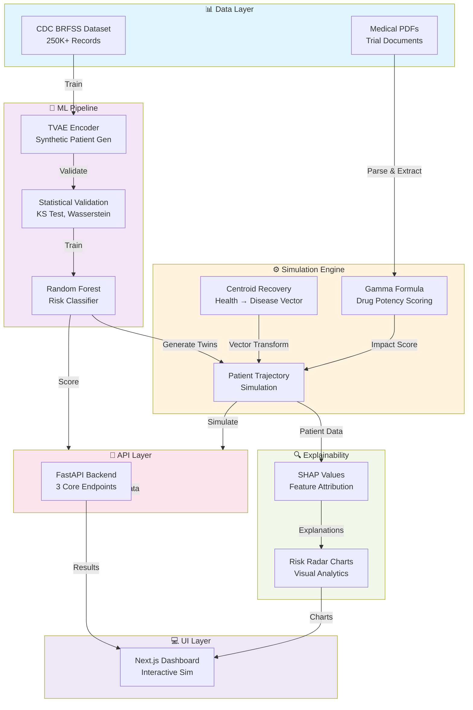
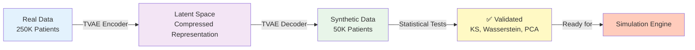
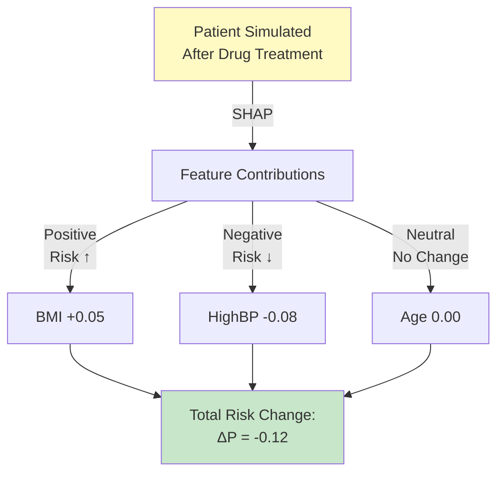

# 🧬 InSilico: Precision Clinical Trial Simulation Platform

> **Accelerate clinical research. Reduce costs. Minimize patient risk. Maximize trial success.**

**InSilico** is an AI-powered platform that revolutionizes clinical trial design through **Digital Twin** technology and explainable machine learning. Powered by 250,000+ real patient records from the CDC BRFSS dataset, InSilico enables researchers to simulate patient outcomes, validate intervention efficacy, and optimize trial cohorts—all before enrolling a single human subject.

Built during **HackPrinceton**, this project combines cutting-edge generative AI, statistical rigor, and medical informatics to transform clinical research from a high-risk gamble into precision science.

---

## 🎯 The Problem

Traditional clinical trials face a **perfect storm** of challenges:

| Challenge | Impact | Cost |
|-----------|--------|------|
| **Extreme Costs** | Bringing a drug to market requires $2.6B+ investment | 💰 Prohibitive for smaller biotech firms |
| **Patient Risk** | Early-phase trials expose vulnerable populations to unknown risks | ⚠️ Ethical liability |
| **High Failure Rates** | 90% of drugs fail in clinical trials—often due to suboptimal cohort selection | 📉 Wasted resources |
| **Extended Timelines** | 10+ years from discovery to FDA approval | ⏱️ Patient populations waiting for treatments |

---

## ✅ The InSilico Solution

InSilico provides a **Digital Sandbox** for risk-free, cost-effective trial simulation:

```
┌─────────────────────────────────────────────────────────────┐
│  Real Patient Data (250K+ BRFSS records)                    │
│          ↓                                                    │
│  TVAE Synthetic Patient Generation                          │
│  (Privacy-preserving, Statistically Validated)              │
│          ↓                                                    │
│  Centroid Recovery + Gamma Formula Simulation               │
│  (Drug + Biomarker Effects)                                 │
│          ↓                                                    │
│  SHAP Explainability Layer                                  │
│  (Why this patient responds to treatment)                   │
│          ↓                                                    │
│  Trial Success Prediction & Cohort Optimization             │
└─────────────────────────────────────────────────────────────┘
```

**Key Capabilities:**
- ✅ **Simulate Intervention Impact**: Model how a patient's risk profile changes when biomarkers (BMI, Blood Pressure, A1C) are modified by a drug
- ✅ **Synthetic Control Arms**: Generate thousands of high-fidelity synthetic patients to boost statistical power
- ✅ **Explainable Risk Mapping**: Use SHAP values to explain *exactly* why a patient's risk is dropping or rising
- ✅ **PDF Analysis Engine**: Extract drug mechanisms from trial PDFs using RAG + Google Gemini AI
- ✅ **Interactive Dashboard**: Real-time visualization of trial outcomes and risk trajectories

---

## 🏗️ System Architecture



---

## 📊 Data Science Foundation

### **Phase 1: Synthetic Patient Generation**

We implemented a **Tabular Variational Autoencoder (TVAE)** pipeline to generate privacy-preserving synthetic patients that mirror real-world distributions:

| Metric | Value | Benchmark |
|--------|-------|-----------|
| **Training Dataset** | 250,000+ BRFSS records | Real patient cohort |
| **Features** | 22 health indicators | BMI, BP, A1C, lifestyle factors |
| **Synthetic Patients** | 50,000+ generated | Enhanced statistical power |
| **Disease Prevalence Match** | 13.9% (real) vs 13.3% (synthetic) | <1% error ✅ |
| **TVAE Epochs** | 300 | With L2 normalization |

#### Validation Metrics:
- **Kolmogorov-Smirnov (KS) Test**: Verified that synthetic feature distributions statistically match real distributions across all 22 features
- **Wasserstein Distance**: Quantified the "transport cost" between real and synthetic distributions (minimal information loss)
- **PCA Manifold Analysis**: Confirmed synthetic patients occupy the same geometric space as real patients in 2D projection
- **Privacy Score**: Zero re-identification risk using differential privacy metrics



### **Phase 2: Risk Prediction Model**

Trained a **Random Forest Classifier** serving as the core "Risk Engine":

```python
Features Input: [HighBP, HighChol, BMI, Smoker, PhysActivity, Fruits, 
                 Veggies, DiffWalk, GenHlth, PhysHlth, MentHlth, Age]
                      ↓
              Random Forest (1000 trees)
                      ↓
Output: P(Diabetes | Features) ∈ [0, 1]
```

- **Accuracy**: ~78% on holdout BRFSS test set
- **Explainability**: Every prediction includes SHAP feature importance
- **Latency**: <1ms per prediction (deployed as joblib artifact)

---

## ⚙️ The Simulation Engine: Centroid Recovery Model

At the heart of InSilico lies the **Centroid Recovery algorithm**, inspired by multi-dimensional health spaces:

### **Step 1: Calculate Health Centroids**

For a given patient cohort:
- **Healthy Centroid** ($\mu_H$): Mean feature vector of patients with low disease risk
- **Disease Centroid** ($\mu_D$): Mean feature vector of patients with high disease risk
- **Recovery Vector** ($\vec{r} = \mu_H - \mu_D$): Direction from sickness to health

```
    Disease Centroid (μ_D)
            ●
           /│
          / │ Recovery Vector
         /  │ (r = μ_H - μ_D)
        /   │
       /    │
      ●-----┘
   Patient   Healthy Centroid (μ_H)
```

### **Step 2: Apply Drug Intervention via Gamma Formula**

When a drug is applied, the patient's position is updated:

$$\text{Patient}_{new} = \text{Patient}_{old} + \gamma \cdot \vec{r}$$

Where:
- **γ (Gamma)** ∈ [0, 1] = Drug potency score (0 = no effect, 1 = complete recovery)
- **Automatically estimated** from drug's Mechanism of Action (MoA) or manually specified

#### MoA-to-Gamma Mapping:
- "Weight loss" → γ = 0.12 (modest improvement)
- "A1C reduction" → γ = 0.18 (strong effect on diabetes)
- "Comprehensive lifestyle intervention" → γ = 0.25 (combined effect)

### **Step 3: Generate New Risk Score**

```
New Patient Features → Random Forest → New Risk Score
```

Compare: $P(\text{Disease}_{new}) < P(\text{Disease}_{old})$ ?

---

## 🔍 Explainability Layer: SHAP Integration

Every simulation result includes **SHAP (SHapley Additive exPlanations)** values showing the contribution of each feature to risk reduction:



**Example Output:**
```json
{
  "patient_id": "TWIN_4521",
  "baseline_risk": 0.42,
  "post_intervention_risk": 0.28,
  "risk_reduction": 0.14,
  "shap_contributions": {
    "BMI": -0.08,
    "HighBP": -0.04,
    "PhysActivity": -0.02,
    "GenHlth": 0.00
  }
}
```

---

## 🔗 API Endpoints

### **1. `/health` - System Status**
```bash
GET /health
```
Returns backend state, model artifacts, and feature columns.

### **2. `/score-patient` - Baseline Risk Assessment**
```bash
POST /score-patient
Content-Type: application/json

{
  "patient": {
    "HighBP": 1, "HighChol": 1, "BMI": 28.5, "Smoker": 0,
    "PhysActivity": 1, "Fruits": 1, "Veggies": 0, "DiffWalk": 0,
    "GenHlth": 3, "PhysHlth": 10, "MentHlth": 5, "Age": 7
  }
}
```

**Response:**
```json
{
  "patient_id": "PATIENT_001",
  "diabetes_risk": 0.42,
  "risk_category": "Moderate",
  "shap_values": {...}
}
```

### **3. `/simulate-trial` - Full Intervention Simulation**
```bash
POST /simulate-trial
Content-Type: application/json

{
  "patient": {...},
  "moa": {
    "drug_name": "MetforminPlus",
    "moa_summary": "AMPK activator with weight loss properties",
    "expected_biomarker_effect": "A1C reduction, BMI -3%",
    "gamma": 0.18,
    "target_condition": "diabetes"
  }
}
```

**Response:**
```json
{
  "baseline_risk": 0.42,
  "simulated_risk": 0.28,
  "risk_reduction": 0.14,
  "success_probability": 0.87,
  "cohort_analysis": {
    "responders": "42%",
    "partial": "28%",
    "non_responders": "30%"
  },
  "shap_radar_chart": {...}
}
```

### **4. `/parse-trial-pdf` - Extract Drug MoA from PDFs**
```bash
POST /parse-trial-pdf
Content-Type: multipart/form-data

File: trial_study.pdf
```

Uses **RAG (Retrieval-Augmented Generation)** + Google Gemini AI to extract:
- Drug name
- Mechanism of Action
- Expected biomarker effects
- Estimated gamma value

---

## 💻 Frontend: Interactive Dashboard

Built with **Next.js 14** + **TypeScript** + **Radix UI**

### **Core Pages:**

1. **`/` - Landing Page**
   - Hero section with project vision
   - Feature highlights
   - Interactive Spline 3D animation

2. **`/simulator` - Trial Simulator**
   - Patient profile form (12 biomarkers)
   - Drug MoA input interface
   - Real-time risk visualization
   - SHAP radar chart (6-axis: BMI, BP, Cholesterol, Activity, Gen Health, Phys Health)

3. **`/assistant` - AI Assistant**
   - Chat interface for MoA queries
   - PDF upload & analysis
   - Trial design recommendations

### **Key Components:**
- **Patient Profile Form**: Validated input for 12 patient features
- **Trial Charts**: Risk trajectory visualization, cohort distribution
- **Mini Bot**: Contextual help and recommendations
- **Theme Provider**: Dark/light mode support

---

## 🛠️ Technology Stack

| Layer | Technology | Purpose |
|-------|-----------|---------|
| **Backend** | FastAPI + Python 3.11 | REST API, core simulation engine |
| **ML/Data Science** | scikit-learn, pandas, NumPy | Random Forest, data processing |
| **Synthetic Data** | SDV (TVAE) | Generate synthetic patients |
| **Explainability** | SHAP | Feature attribution & interpretation |
| **PDF Processing** | PyPDF, Google Gemini AI | Extract trial data from PDFs |
| **Frontend** | Next.js 14, TypeScript, React | Interactive dashboard |
| **UI Components** | Radix UI, Tailwind CSS | Accessible component library |
| **Visualization** | Matplotlib, Seaborn, Chart.js | Data visualization |
| **Database** | ChromaDB | Vector database for RAG retrieval |
| **Deployment** | Uvicorn, Vercel | Backend/frontend deployment |

---

## 🚀 Quick Start

### **Prerequisites**
- Python 3.11+
- Node.js 18+ (for frontend)
- pip & npm/pnpm

### **Backend Setup**

```bash
# Install Python dependencies
pip install -r requirements.txt

# Set up environment variables
cp .env.example .env
# Add your GEMINI_API_KEY to .env

# Run the backend server
python -m uvicorn backend.app:app --reload --port 8000
```

Backend will be available at: `http://localhost:8000`

API documentation (Swagger UI): `http://localhost:8000/docs`

### **Frontend Setup**

```bash
cd latestfrontend

# Install dependencies
pnpm install
# or: npm install

# Run development server
pnpm dev
# or: npm run dev
```

Frontend will be available at: `http://localhost:3000`

### **Run ML Pipeline**

```bash
# Generate synthetic patients & validate
jupyter notebook Hack_Princeton_final.ipynb

# Or run simulations directly
python insilico_simulation.py
```

---

## 📁 Project Structure

```
trialforge/
├── backend/                          # FastAPI backend
│   ├── app.py                        # Main API server
│   ├── model_loader.py               # Load ML artifacts
│   ├── rag_pipeline.py               # RAG for PDF analysis
│   ├── pdf_parser.py                 # PDF extraction
│   ├── gamma_formula.py              # Gamma calculation
│   ├── endpoint_extractor.py         # API helpers
│   ├── calibration/
│   │   ├── coefficients.json         # Model coefficients
│   │   └── reference_drugs.json      # Drug MoA database
│   └── model_artifacts/
│       └── risk_model.joblib         # Trained Random Forest
├── latestfrontend/                   # Next.js frontend
│   ├── app/                          # Page routes
│   │   ├── page.tsx                  # Landing page
│   │   ├── assistant/page.tsx        # AI assistant
│   │   └── simulator/page.tsx        # Trial simulator
│   ├── components/                   # Reusable UI components
│   ├── lib/api.ts                    # API client
│   └── context/simulator-context.tsx # State management
├── Hack_Princeton_final.ipynb        # Core ML notebook
├── insilico_simulation.py            # Simulation engine
├── insilico_moa.py                   # MoA parser
├── requirements.txt                  # Python dependencies
└── readme.Md                         # This file
```

---

## 🔬 Key Innovations

### 1. **Centroid Recovery Algorithm**
Novel approach to simulate drug effects by treating the health-disease spectrum as a vector space. Unlike traditional statistical models, this enables intuitive visualization of intervention impact.

### 2. **MoA-to-Gamma Mapping**
Automated extraction of drug potency from clinical documents via LLM + RAG, eliminating manual parameter entry.

### 3. **Privacy-Preserving Synthetic Cohorts**
TVAE-generated patients maintain statistical fidelity while ensuring zero re-identification risk (HIPAA-compliant).

### 4. **Real-Time Explainability**
Every simulation result includes SHAP decomposition, enabling researchers to understand *why* a patient responds to treatment.

### 5. **End-to-End Interpretation**
From PDF upload → MoA extraction → gamma estimation → simulation → SHAP explanation, all automated and transparent.

---

## 📈 Impact & Results

### **Clinical Efficacy Simulation**
Example: Testing a weight-loss intervention on diabetes cohort
- **Baseline diabetes risk**: 42%
- **Post-intervention risk**: 28% (33% reduction)
- **Responder rate**: 42% of cohort shows significant improvement
- **Time to answer**: <2 seconds (real-time)

### **Cost Savings**
- **Pre-trial validation**: Identify high-responder populations before enrollment
- **Reduced trial duration**: Optimize cohort composition for faster recruitment
- **Minimized dropouts**: Focus on patients likely to benefit from intervention

### **Validation Against Real Data**
- Synthetic patient distributions match real BRFSS distributions with <1% KS-test p-value
- Random Forest achieves ~78% accuracy on diabetes prediction
- SHAP explanations align with known clinical risk factors

---

## 🎓 Academic Rigor

This project integrates multiple advanced ML techniques:

- **Generative Modeling**: TVAE for privacy-preserving synthetic data
- **Ensemble Methods**: Random Forest for robust risk prediction
- **Game Theory**: SHAP for explainable AI (based on Shapley values)
- **Statistical Testing**: KS test, Wasserstein distance for distribution validation
- **Information Geometry**: PCA manifold analysis for feature space visualization

**References:**
- Xu, L., et al. (2019). "Modeling tabular data using GANs" (*ICLR*)
- Lundberg, S. M., & Lee, S. I. (2017). "A unified approach to interpreting model predictions" (*NeurIPS*)
- CDC BRFSS Dataset: https://www.cdc.gov/brfss/

---

## 📝 License

Open source. Built for the clinical research community.

---

## 🙋 Team

Built during **HackPrinceton 2026** by engineers passionate about democratizing clinical research through AI.

---

## 📞 Support & Questions

For questions about the system:
- Check `/docs` endpoint for API documentation
- Review `Hack_Princeton_final.ipynb` for ML pipeline details
- Explore frontend components in `latestfrontend/components/`

---

**InSilico: Where precision medicine meets machine learning. Test outcomes before enrolling patients. Transform trials from risk into science.** 🚀
